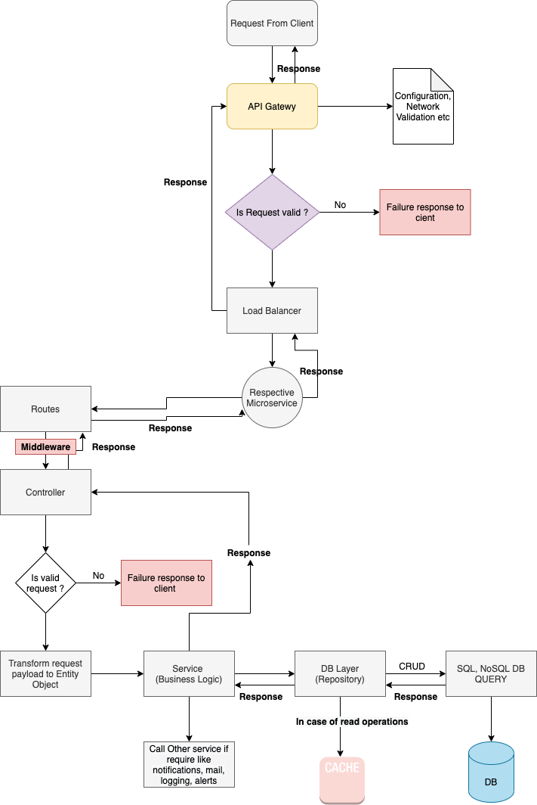

# E-Commerce Services

Heroku URL:  https://ecommerce-service-ifa.herokuapp.com/
API DOCS: https://ecommerce-service-ifa.herokuapp.com/api-docs


Current code layers communication:

```Routes ---> Middleware ---> Controller ---> Mongoose Models validation ---> Repository ---> DB```

Better code layer communication:



```
NOTE: Because of timeline failed to add design patterns.
```

### Postman Collection and YAML file
- postman.json
- open-api.yml

#### Local Command: 
```yarn start-local```

### Prerequisite tools:
1. yarn package manager
2. node
3. nodemon
4. Heroku CLI
5. Download heroku accounts plugin  (CMD: heroku plugins:install heroku-accounts)

### Tech Stack, Database , Cache and Image services

1. Node.js
2. Mongodb
4. Node Cache

### Run Scripts locally
    "start": "nodemon ./bin/www",
    "start-local": "export NODE_ENV=local; nodemon ./bin/www",

### Environment files
    - .env.local

### Functionality

1. Register ( Admin or User)
2. Login
3. CRUD Product
4. CRUD Product Category
5. CRUD User/User Address/User Payment Registration
6. Search Product by name
7. Start/DELETE Session
8. Add Items To CART
10. Convert CART to ORDER
11. View ORDERS/ ORDERS ITEMS


### Middleware
1. Create/Update/Delete Product - can only be perform by admin
2. Create/Update/Delete Product Category - can only be perform by admin
3. Read Product and Read Category - can only be perform by any user with token
4. REGISTER/LOGIN - Any user


#### SEQUENCE TO RUN API
``` NOTE: All requests except auth request needs x-session-token and x-user-id in headers ``` 
 - Register (register)
 - Login (login)
 - Add User Address (UserAddress)
 - Add User Payment (PaymentRegistration)
 - Create Product Categories (Category)
 - Create Product (Should belong to one category id) (products)
 - Start Session (Cart Session)
 - Add Item to cart (AddItemToCArt)
 - Order Create (OrderCreate) [on successfully creation - cart session is deleted]
 - Get Orders
 
  
### Heroku Deployments

**In order to allow heroku to use different env files, update the environment variable of NODE_ENV or 
add NODE_ENV in config from Heroku dashboard**

Naive Way to Deploy:
Ref: https://devcenter.heroku.com/articles/github-integration

**To add accounts:**
```
heroku accounts:add <account_name>
Enter your Heroku credentials.
Email: a@b.c
Password: ******
```

**To switch to a different account:**
```
heroku accounts:set <account_name>
```

**Heroku Accounts:**
    
    - test (API KEY: xxxxxxxxxxxxxx)
    
**Heroku Git Origin :**
    
    - heroku-test (cmd: git push heroku master)

    
Environment:

    - URL: <<URL>>
    - Email: <<EMAIL>>
    - Password: <<PASSWORD>>


### Deploy to heroku server using bash script
``` bash ./service.sh```

- Merge or push to **release/app** branch in order to run pipeline and deploying to production

